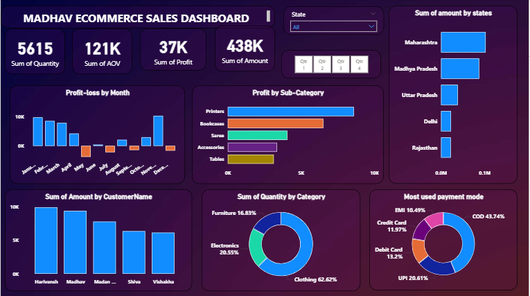

# 🛒 Madhav E-Commerce Sales Dashboard
### Power BI | Data Modeling | DAX | Business Intelligence

---

## 📌 Project Overview

An interactive Power BI sales dashboard analyzing **500 orders and 1,500 line items** across **19 Indian states and 25 cities** — uncovering revenue patterns, profit trends, customer behavior, and payment insights from **₹4.38L in total sales.**

**Tech Stack:**
- **Power BI Desktop** — Dashboard Design, DAX Measures, Data Modeling
- **Power Query** — Data Transformation, Cleaning, Reshaping
- **Data Source** — Orders.csv + Details.csv (relational datasets)

---

## 🏗️ Project Architecture

```
Orders.csv + Details.csv (Raw Data)
        ↓
Power Query (Data Cleaning + Transformation)
        ↓
Power BI Data Model (Relationship via Order ID)
        ↓
DAX Measures (KPIs + Calculated Columns)
        ↓
Interactive Executive Dashboard
```

---

## 📊 Dataset Overview

| Metric | Value |
|--------|-------|
| Total Orders | 500 |
| Total Line Items | 1,500 |
| Total Sales Amount | ₹4,37,771 |
| Total Profit | ₹36,963 |
| Total Quantity Sold | 5,615 units |
| Avg Order Value | ₹291.85 |
| Profit Margin | 8.44% |
| States Covered | 19 |
| Cities Covered | 25 |
| Unique Customers | 336 |
| Product Categories | 3 (Electronics, Clothing, Furniture) |
| Payment Modes | 5 (COD, UPI, Debit Card, Credit Card, EMI) |

---

## 🧠 Analytics Performed

### 🔹 Data Modeling
- Merged **2 relational datasets** (Orders + Details) via **Order ID** as relational key
- Built relationships between tables for cross-dataset analysis
- Created calculated columns for Quarter, Month, and Category-level aggregations

### 🔹 DAX Measures
- Total Revenue, Total Profit, Total Quantity — real-time KPI tracking
- Avg Order Value calculation across 1,500 line items
- Quarterly performance filters (Q1–Q4) for trend comparison
- Profit margin calculation at category and sub-category level

---

## 📈 Key Business Insights

| Finding | Metric | Business Action |
|---------|--------|-----------------|
| Top Revenue Category | Electronics — ₹1.66L (38%) | Prioritize Electronics inventory |
| Top Quantity Category | Clothing — 3,516 units (62.6%) | Scale Clothing supply chain |
| Best Profit Month | November — ₹10,253 profit | Leverage pre-holiday demand |
| Loss Months | May, July, Sep, Dec — 4 months | Launch targeted promotions |
| Top State | Maharashtra — ₹1.02L revenue | Focus regional marketing |
| Dominant Payment | COD — 684 transactions (45.6%) | Incentivize digital payments |
| Top Customer | Harivansh — ₹9,902 revenue | Build loyalty programs |

### 🔹 Sub-Category Profit Leaders

| Sub-Category | Profit |
|-------------|--------|
| Printers | ₹8,606 |
| Bookcases | ₹6,516 |
| Saree | ₹4,057 |
| Accessories | ₹3,353 |
| Tables | ₹3,139 |

### 🔹 State-wise Revenue

| State | Revenue |
|-------|---------|
| Maharashtra | ₹1,02,498 |
| Madhya Pradesh | ₹87,463 |
| Uttar Pradesh | ₹38,362 |
| Delhi | ₹22,957 |
| Rajasthan | ₹22,334 |

---

## 📊 Power BI Dashboard Features

**KPI Cards:**
- ✅ Total Sales — **₹4.38L**
- ✅ Total Profit — **₹36,963**
- ✅ Total Quantity — **5,615 units**
- ✅ Avg Order Value — **₹291.85**

**Visuals Included:**
- Profit & Loss by Month (12-month trend)
- Revenue by State (Top 5 comparison)
- Sales by Category & Sub-Category
- Customer-wise Revenue breakdown
- Payment Mode distribution (Pie chart)
- Quarterly filter (Q1, Q2, Q3, Q4)

---

## 📂 File Structure

```
📁 Madhav-Store-Sales-Dashboard
├── madhavstores.pbix         # Power BI dashboard file
├── Orders__1_.csv            # Customer order data
├── Details.csv               # Order line item details
└── msd.PNG                   # Dashboard preview
```

---

## 🚀 How to Use

1. Download **Orders__1_.csv** and **Details.csv** — raw data files
2. Open **madhavstores.pbix** in Power BI Desktop
3. Explore the interactive dashboard using Quarter filters and category slicers
4. All relationships and DAX measures are pre-built — no setup required

---

## 🎯 Conclusion

This dashboard converts **500 raw e-commerce orders into actionable business intelligence** — identifying that:
- 📦 **Clothing dominates quantity** at 62.6% but Electronics leads revenue at 38%
- 📅 **4 loss-making months** (May, July, September, December) signal seasonal demand gaps
- 💳 **COD dominates at 45.6%** — digital payment adoption opportunity
- 🏆 **Printers are the most profitable sub-category** at ₹8,606 profit
- 🗺️ **Maharashtra alone contributes ₹1.02L** — 23.4% of total revenue

---

## 📸 Dashboard Preview




